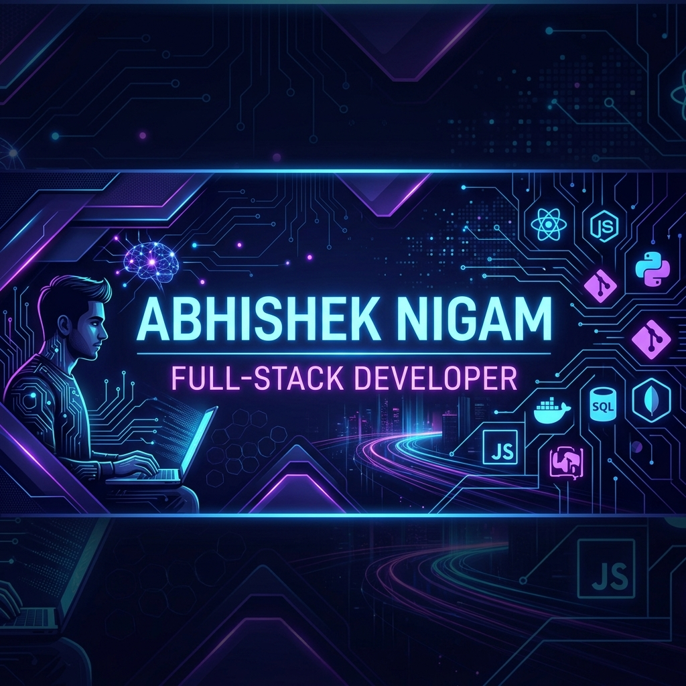

  

<h1 align="center">Hi there, I'm Abhishek Nigam 👋</h1>

  <b>Full-Stack Software Engineer | U.S. Patent Holder | GATE Qualifier</b>

  
  

---

### 🚀 About Me
I am a **Full-Stack Software Engineer** dedicated to building high-performance, scalable web applications and solving complex algorithmic challenges. With a focus on **Frontend Engineering (Next.js/React)** and experience in **Backend Architecture (Node.js)**, I bridge the gap between stunning UI and robust systems.

- 🎓 **GATE Qualified** with a high percentile, demonstrating strong analytical and engineering fundamentals.
- 💡 **US Patent Filing** for "AI-Adaptive VM Placement" research, reflecting a passion for cloud optimization.
- 🛠️ Currently focused on **System Design**, **Frontend Performance**, and **Real-time Distributed Services**.
- 🌟 Active problem solver on **LeetCode**, constantly refining Data Structures & Algorithms expertise.

---

### 🛠️ Tech Stack

| Category | Tools & Technologies |
| :--- | :--- |
| **Frontend** |      |
| **Backend** |     |
| **Databases** |     |
| **DevOps & Cloud** |     |
| **Core Languages** |    |

---

### 📊 GitHub Insights

  
  

  

---

### 🏆 Featured Projects
- 🎨 **[Collab Canvas](https://github.com/Aryan972/collab-canvas)**: Real-time multiplayer collaborative drawing tool with WebSocket integration.
- ☁️ **[Infra Optimiser](https://github.com/Aryan972/ai-adaptive-vm-placement-patent)**: AI-driven VM placement system for cloud infrastructure optimization (Patented Research).
- 📅 **[Meeting Scheduler](https://github.com/Aryan972/next-js)**: A full-stack scheduling application built with Next.js and MongoDB.

---

### ✍️ Random Dev Quote

  

---

### 📫 Connect With Me

   
  <i>"Turning complex problems into simple, high-performance user experiences."</i>

